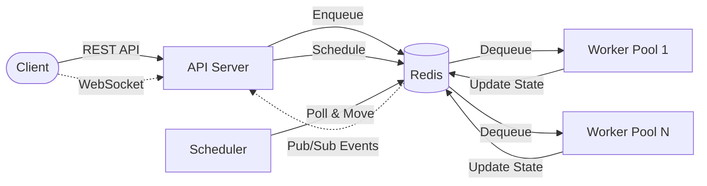
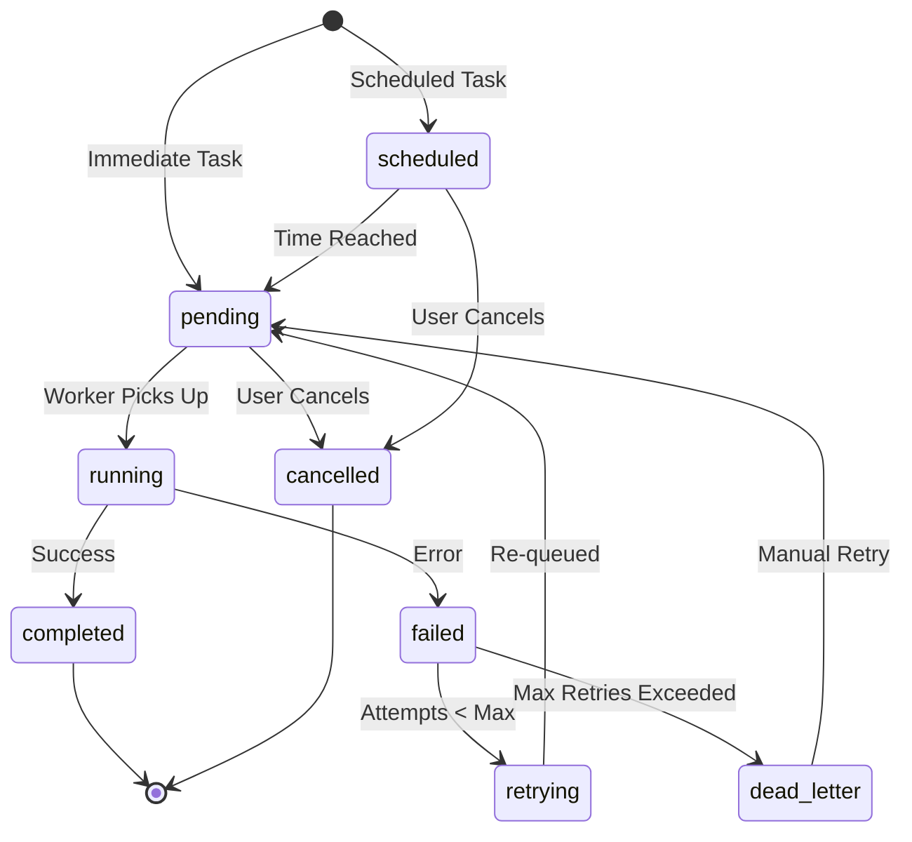
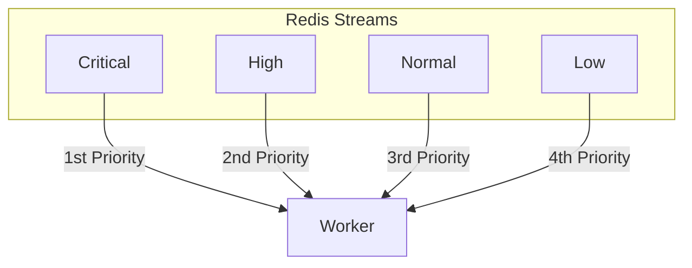

# Task Queue Go

[](https://github.com/maumercado/task-queue-go/actions/workflows/ci.yml)
[](https://goreportcard.com/report/github.com/maumercado/task-queue-go)


A horizontally scalable distributed task queue built with Go and Redis Streams.

## Features

- **Priority-based scheduling** - 4 priority levels (critical, high, normal, low)
- **Scheduled tasks** - Delayed execution with `scheduled_at` timestamp
- **At-least-once delivery** - Redis consumer groups with automatic recovery
- **Retry with backoff** - Exponential backoff with jitter
- **Dead letter queue** - Failed tasks preserved for inspection and replay
- **Real-time events** - WebSocket streaming of task and worker events
- **Backpressure** - Queue capacity limits (503) and per-client rate limiting (429)
- **Task retention** - Automatic cleanup of completed tasks after configurable TTL
- **Metrics** - Prometheus metrics for monitoring
- **Graceful shutdown** - In-flight tasks complete before exit

## Quick Start

### Prerequisites

- Go 1.21+
- Redis 7+

### Run with Docker

```bash
docker-compose up -d
```

This starts Redis, API server, workers, and Prometheus.

### Run Locally

```bash
# Start Redis
make dev-redis

# Terminal 1: API server
make run-api

# Terminal 2: Worker
make run-worker
```

## Usage Examples

### Submit an Immediate Task

```bash
curl -X POST http://localhost:8080/api/v1/tasks \
  -H "Content-Type: application/json" \
  -d '{
    "type": "echo",
    "payload": {"message": "Hello, World!"},
    "priority": 2
  }'
```

### Submit a Scheduled Task

```bash
# Schedule a task for 30 seconds in the future
curl -X POST http://localhost:8080/api/v1/tasks \
  -H "Content-Type: application/json" \
  -d '{
    "type": "echo",
    "payload": {"message": "Delayed task"},
    "scheduled_at": "2024-01-15T12:00:00Z"
  }'
```

The task will have state `scheduled` until the scheduled time, then transition to `pending`.

### Check Task Status

```bash
curl http://localhost:8080/api/v1/tasks/{task_id}
```

### Cancel a Task

```bash
curl -X DELETE http://localhost:8080/api/v1/tasks/{task_id}
```

## API Endpoints

### Tasks

| Method | Endpoint | Description |
|--------|----------|-------------|
| POST | `/api/v1/tasks` | Submit a new task |
| GET | `/api/v1/tasks/{id}` | Get task by ID |
| DELETE | `/api/v1/tasks/{id}` | Cancel a pending/scheduled task |
| GET | `/api/v1/tasks` | Get queue depths |

### Admin

| Method | Endpoint | Description |
|--------|----------|-------------|
| GET | `/admin/health` | Health check |
| GET | `/admin/workers` | List active workers |
| GET | `/admin/workers/{id}` | Get worker details |
| POST | `/admin/workers/{id}/pause` | Pause a worker |
| POST | `/admin/workers/{id}/resume` | Resume a worker |
| GET | `/admin/queues` | Queue statistics |
| DELETE | `/admin/queues/{priority}` | Purge a priority queue |
| POST | `/admin/tasks/{id}/retry` | Retry a failed task |
| GET | `/admin/dlq` | Dead letter queue contents |
| POST | `/admin/dlq/retry` | Retry tasks from DLQ |
| DELETE | `/admin/dlq` | Clear DLQ |

### Other

| Method | Endpoint | Description |
|--------|----------|-------------|
| GET | `/ws` | WebSocket for real-time events |
| GET | `/metrics` | Prometheus metrics |

## Testing the Features

### Test Scheduled Tasks

```bash
# Submit a task scheduled 10 seconds from now (macOS)
curl -X POST http://localhost:8080/api/v1/tasks \
  -H "Content-Type: application/json" \
  -d '{
    "type": "echo",
    "payload": {"message": "delayed"},
    "scheduled_at": "'$(date -u -v+10S +%Y-%m-%dT%H:%M:%SZ)'"
  }'

# On Linux, use: $(date -u -d '+10 seconds' +%Y-%m-%dT%H:%M:%SZ)

# Check status - should be "scheduled"
curl http://localhost:8080/api/v1/tasks/<task_id>

# Wait 10+ seconds, check again - should be "completed"
```

### Test Worker Pause/Resume

```bash
# List workers to get worker ID
curl http://localhost:8080/admin/workers

# Pause a worker
curl -X POST http://localhost:8080/admin/workers/<worker_id>/pause

# Worker will stop picking up new tasks
# Resume the worker
curl -X POST http://localhost:8080/admin/workers/<worker_id>/resume
```

### Test Manual Task Retry

```bash
# Get a failed task ID from DLQ
curl http://localhost:8080/admin/dlq

# Retry the task
curl -X POST http://localhost:8080/admin/tasks/<task_id>/retry
```

### Test Queue Purge

```bash
# Purge all tasks from the low priority queue
curl -X DELETE http://localhost:8080/admin/queues/low
```

### Test Health Check

```bash
curl http://localhost:8080/admin/health
# Returns: {"status":"healthy","redis":"connected"}
```

## Task Structure

```json
{
  "type": "email",
  "payload": {
    "to": "user@example.com",
    "subject": "Welcome"
  },
  "priority": 2,
  "max_retries": 5,
  "timeout": 300,
  "scheduled_at": "2024-01-15T12:00:00Z",
  "metadata": {
    "user_id": "123"
  }
}
```

**Priority levels:**

- `0` - Low
- `1` - Normal (default)
- `2` - High
- `3` - Critical

## Configuration

Configuration via environment variables (prefix `TASKQUEUE_`) or `config.yaml`.

| Variable | Default | Description |
|----------|---------|-------------|
| `TASKQUEUE_SERVER_PORT` | 8080 | API server port |
| `TASKQUEUE_REDIS_ADDR` | localhost:6379 | Redis address |
| `TASKQUEUE_WORKER_CONCURRENCY` | 10 | Concurrent tasks per worker |
| `TASKQUEUE_QUEUE_RETRYMAXATTEMPTS` | 3 | Max retry attempts |
| `TASKQUEUE_QUEUE_MAXQUEUESIZE` | 1000000 | Max queue depth (503 when exceeded) |
| `TASKQUEUE_QUEUE_RATELIMITRPS` | 1000 | Rate limit per client (429 when exceeded) |
| `TASKQUEUE_QUEUE_TASKRETENTIONDAYS` | 7 | Days to keep completed tasks |
| `TASKQUEUE_LOGLEVEL` | info | Log level |

See [config.yaml](config.yaml) for all options.

## Adding Task Handlers

Register handlers in `cmd/worker/main.go`:

```go
handlers := map[string]worker.TaskHandler{
    "email": func(ctx context.Context, t *task.Task) (map[string]interface{}, error) {
        to := t.Payload["to"].(string)
        // Send email...
        return map[string]interface{}{"sent": true}, nil
    },
}
```

## Architecture

See [docs/architecture.md](docs/architecture.md) for details.



### Task Lifecycle



### Priority Queue Processing



## Monitoring

After running `docker-compose up`:

| Service | URL | Description |
|---------|-----|-------------|
| API | http://localhost:8080 | REST API |
| Prometheus | http://localhost:9090 | Metrics dashboard |
| Metrics | http://localhost:8080/metrics | Raw Prometheus metrics |

## Development

```bash
# Run tests
make test

# Run tests with coverage
make test-coverage

# Build binaries
make build
```

## Load Testing

Requires [k6](https://k6.io/):

```bash
brew install k6  # macOS

# Quick smoke test
make load-test-smoke

# Full load test suite
make load-test

# Stress test
make load-test-stress
```

## Client SDKs

Client SDKs are generated from the [OpenAPI specification](docs/openapi.yaml).

### Go Client

```go
import "github.com/maumercado/task-queue-go/pkg/client"

// Create client
c, err := client.New("http://localhost:8080",
    client.WithAPIKey("your-api-key"),
    client.WithTimeout(30 * time.Second),
)

// Submit a task
task, err := c.SubmitTask(ctx, client.CreateTaskRequest{
    Type: "email",
    Payload: &map[string]interface{}{
        "to": "user@example.com",
    },
})

// Get task status
task, err = c.GetTaskByID(ctx, task.Id.String())

// WebSocket events
c.ConnectWebSocket(ctx)
for event := range c.Events() {
    fmt.Printf("Event: %s\n", event.Type)
}
```

### TypeScript Client

```typescript
import { TaskQueueClient } from '@task-queue/client';

// Create client
const client = new TaskQueueClient('http://localhost:8080', {
  apiKey: 'your-api-key',
});

// Submit a task
const task = await client.createTask({
  type: 'email',
  payload: { to: 'user@example.com' },
});

// Get task status
const status = await client.getTask(task.id);

// WebSocket events
await client.connectWebSocket();
client.onEvent('task.completed', (event) => {
  console.log('Task completed:', event.data);
});
```

### Regenerate Clients

```bash
# Generate Go client
make generate-go-client

# Generate TypeScript client
make generate-ts-client

# Generate all clients
make generate-clients
```

See [examples/go](examples/go) and [examples/typescript](examples/typescript) for complete usage examples.

## Documentation

- [API Reference](docs/api.md)
- [Architecture](docs/architecture.md)
- [OpenAPI Specification](docs/openapi.yaml)
- [Go Client](pkg/client/doc.go)
- [TypeScript Client](clients/typescript/README.md)

## License

MIT
