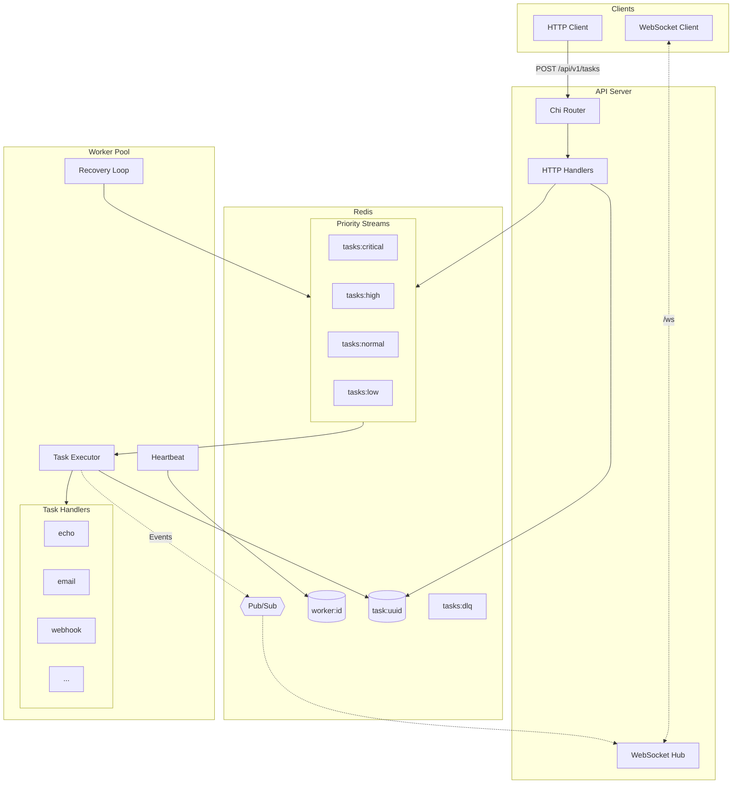
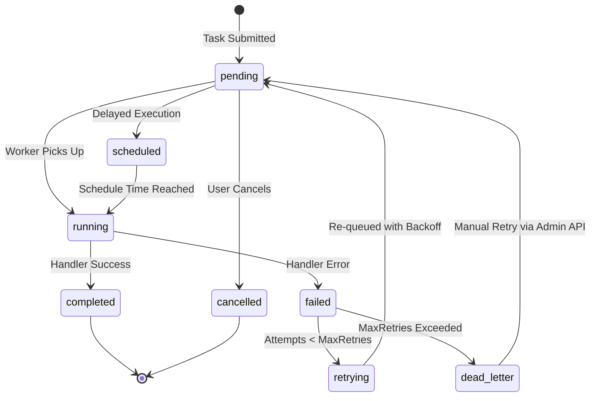

# Architecture

## Overview

The task queue consists of two main components that communicate through Redis:

1. **API Server** - Accepts task submissions, serves admin endpoints, broadcasts events
2. **Worker Pool** - Consumes and executes tasks from the queue



## Redis Data Model

### Streams (Priority Queues)

Four separate streams for priority-based consumption:

```
tasks:critical  →  [msg-id: {task_id, type}]
tasks:high      →  [msg-id: {task_id, type}]
tasks:normal    →  [msg-id: {task_id, type}]
tasks:low       →  [msg-id: {task_id, type}]
```

Workers consume from streams in priority order (critical first). Consumer groups ensure each message is delivered to exactly one worker.

### Task Data

Full task data stored separately:

```
task:{uuid} → {
  id, type, payload, priority, state,
  attempts, max_retries, error, result,
  worker_id, created_at, updated_at, ...
}
```

This separation keeps stream messages small (~50 bytes) while supporting large payloads.

### Worker Registry

```
workers:active        → SET of worker IDs
worker:{id}:heartbeat → timestamp (TTL: 15s)
worker:{id}:info      → {id, state, started_at, active_tasks, ...}
```

### Dead Letter Queue

```
tasks:dlq     → STREAM of failed tasks
tasks:dlq:set → SET of task IDs in DLQ (for O(1) lookup)
```

## Task Lifecycle



**State Transitions:**
- `PENDING → RUNNING`: Worker picks up task
- `RUNNING → COMPLETED`: Handler returns success
- `RUNNING → FAILED`: Handler returns error
- `FAILED → RETRYING`: Attempts < max_retries
- `FAILED → DEAD_LETTER`: Attempts >= max_retries
- `DEAD_LETTER → PENDING`: Manual requeue via admin API

## Consumer Group Mechanics

Redis Streams consumer groups provide:

1. **Load balancing**: Messages distributed across consumers
2. **Acknowledgment**: Messages tracked until ACK'd
3. **Pending Entry List (PEL)**: Unacknowledged messages retained

```
XREADGROUP GROUP workers CONSUMER worker-abc STREAMS tasks:high >
```

The `>` means "give me new messages only". Unacknowledged messages can be claimed by other workers using `XCLAIM`.

## Orphan Recovery

When a worker crashes, its tasks remain in the PEL. The recovery loop:

1. Runs every 2× heartbeat interval
2. Finds messages idle longer than `claim_min_idle` (30s default)
3. Claims them with `XCLAIM`
4. Re-queues for processing

```go
// Simplified recovery logic
pending := XPENDING tasks:high workers - + 100
for msg in pending {
    if msg.idle > claimMinIdle {
        XCLAIM tasks:high workers this-worker 30000 msg.id
        // Re-enqueue task
    }
}
```

## Retry Strategy

Exponential backoff with jitter:

```
backoff = min(initial * factor^attempt, max) + random_jitter
```

Default values:
- Initial: 1 second
- Factor: 2.0
- Max: 5 minutes
- Jitter: ±10%

Example delays: 1s → 2s → 4s → 8s → ... → 5m (capped)

## WebSocket Events

Events flow: Worker → Redis Pub/Sub → API Server → WebSocket Hub → Clients

```
Event Types:
- task.submitted, task.started, task.completed, task.failed
- worker.joined, worker.left, worker.paused
- queue.depth, system.metrics
```

Clients subscribe via WebSocket at `/ws`. Events are JSON:

```json
{
  "type": "task.completed",
  "timestamp": "2024-01-15T10:30:00Z",
  "data": {
    "task_id": "abc-123",
    "type": "email",
    "duration_ms": 150
  }
}
```

## Scaling

### Horizontal Scaling

- **API Servers**: Stateless, scale behind load balancer
- **Workers**: Add more instances, consumer groups handle distribution
- **Redis**: Single instance for simplicity; Redis Cluster for high availability

### Performance Characteristics

| Operation | Latency | Throughput |
|-----------|---------|------------|
| Task submission | <10ms P95 | 10k/sec |
| Task fetch | <5ms | Limited by handlers |
| WebSocket broadcast | <100ms | N/A |

### Bottlenecks

1. **Redis**: Single-threaded command processing
2. **Handler execution**: CPU/IO bound by task logic
3. **Network**: Redis round-trips

## Metrics

Key Prometheus metrics:

```
taskqueue_tasks_submitted_total{type, priority}
taskqueue_tasks_completed_total{type, status}
taskqueue_task_duration_seconds{type}
taskqueue_queue_depth{priority}
taskqueue_active_workers
taskqueue_dlq_size
```
