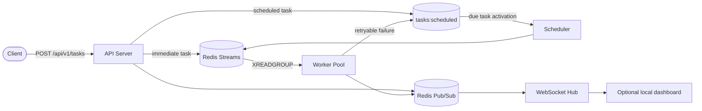
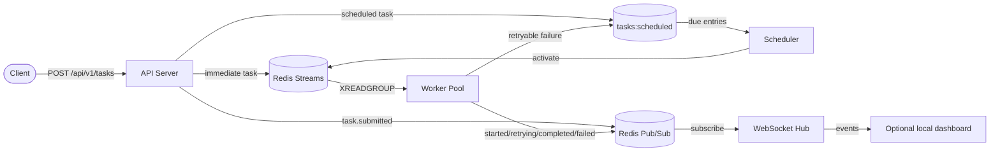
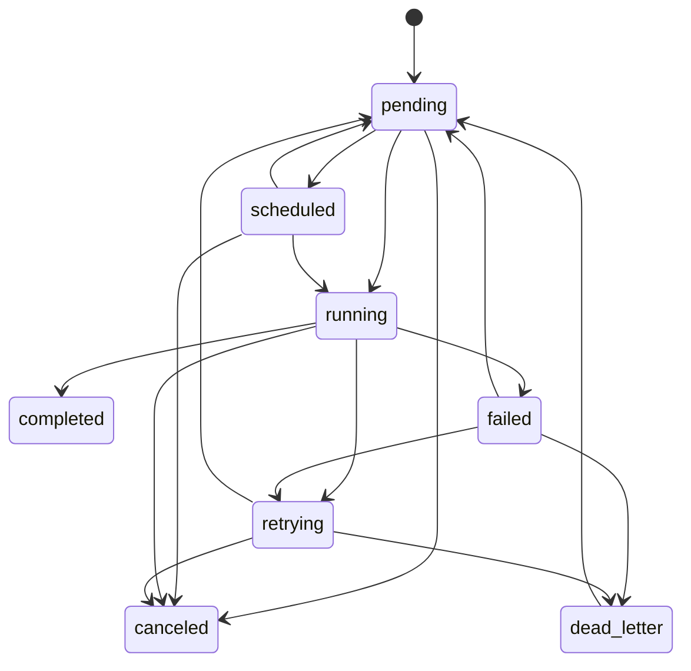

# Building a Distributed Task Queue in Go with Redis Streams

Status: **Draft v1**

Target length: **2400-3000 words**

## Goal

Write a technical architecture deep dive that explains how this repository uses
Redis Streams, a sorted set scheduler, explicit task state transitions, and
real event publishing to implement a distributed task queue in Go.

The post should stay technical. No screenshots. Point readers to the repository
so they can run the system locally and inspect behavior on their own.

## Intended Reader

Backend engineers who are comfortable with distributed systems concepts but may
not be familiar with this codebase or with Go specifically.

## Working Title

**Building a Distributed Task Queue in Go with Redis Streams**

Alternative title candidates:

- Designing a Distributed Task Queue in Go with Redis Streams
- Inside a Distributed Task Queue in Go with Redis Streams
- From Redis Streams to Task Queue: Building It in Go

## Thesis

This project uses Redis Streams for delivery, a sorted set for deferred work,
and an explicit task state machine to build a distributed task queue in Go.

Strongest architectural idea to emphasize:

> One deferred-work primitive powers both user-scheduled jobs and automatic
> retries.

## Outline

### 1. Introduction (180-250 words)

Most applications need some form of background work: send an email after a
signup, generate a report, retry a webhook, or delay a job until some future
time. The hard part is usually not pushing work into a queue. The hard part is
everything that comes after: retries, visibility, prioritization, delayed
execution, and recovery when a worker dies halfway through processing.

This repository builds those pieces on top of Redis, using Redis Streams for
delivery and a sorted set for deferred execution. That choice matters because
many teams already run Redis in production. If Redis is already part of your
stack, it is worth understanding how far you can push it before reaching for a
larger message bus or a dedicated job system.

The design here has one especially strong idea: delayed jobs and automatic
retries share one deferred-work mechanism. A user-scheduled task and a retrying
failed task both sit in `tasks:scheduled` until they are due. That keeps the
implementation smaller, observability more consistent, and the control flow
easier to explain.

In this post, I will walk through the architecture, the Redis data model, the
worker lifecycle, the retry path, and the queue stats model. The goal is not to
sell Redis Streams as a universal answer. The goal is to show how they can be
used to build a practical distributed task queue with explicit tradeoffs.

### 2. Architecture Overview (220-320 words)

The system is split into two binaries. `cmd/api-server/` accepts task
submissions, exposes admin endpoints, runs the scheduler, and publishes live
events. `cmd/worker/` joins a Redis consumer group, executes task handlers,
applies retry policy, and recovers orphaned work from dead consumers.

Redis does most of the coordination work. Priority streams such as
`tasks:critical` and `tasks:normal` carry queue delivery. The sorted set
`tasks:scheduled` stores deferred work, which includes both user-scheduled
tasks and retryable failures waiting for backoff to expire. Redis Pub/Sub is
used separately for lifecycle events so the system can emit `task.submitted`,
`task.started`, `task.retrying`, `task.completed`, `task.failed`, and worker
state changes without polling every API endpoint.

At a high level, the API server either enqueues a task immediately or stores it
for future activation. Workers consume from Redis Streams through a consumer
group, update task state in Redis, acknowledge messages only after the task has
been safely handled, and push exhausted failures into the dead letter queue.
When a retryable task fails, the worker does not immediately re-enqueue it.
Instead, it computes a backoff delay and routes the task back through deferred
execution.

Repo references:

- `cmd/api-server/main.go`
- `cmd/worker/main.go`
- `internal/api/routes.go`
- `internal/worker/pool.go`

Mermaid reference sketch for final Excalidraw diagram:



### 3. Redis Data Model (280-380 words)

The Redis data model separates transport from task state. Stream entries are
small. They carry only the fields a worker needs to look up the real task
record, such as `task_id` and `type`. The full task payload, timestamps,
attempt counters, retry metadata, and result fields live in a separate key like
`task:{id}`. That split is one of the most important implementation choices in
the project.

If large payloads were stored directly in stream messages, every delivery,
claim, and acknowledgment path would move more data than necessary. By keeping
the stream entry lightweight, the stream behaves more like a delivery index than
like the canonical storage layer. Redis Streams handle coordination. The task
record handles state.

Priority is implemented with separate streams rather than one stream plus a
priority field. The project uses `tasks:critical`, `tasks:high`,
`tasks:normal`, and `tasks:low`. That makes consumption logic more explicit and
lets workers listen across all priorities in a known order.

Deferred work lives in the sorted set `tasks:scheduled`. The score is a future
Unix timestamp. A task sitting in that set may be in `scheduled` state because a
user asked for delayed execution, or it may be in `retrying` state because a
worker scheduled it for exponential backoff after failure. The scheduler does
not need separate storage for those cases; it only needs to know that the task
is due.

Finally, Redis consumer groups maintain a Pending Entries List, or PEL. That is
the record of messages that have been delivered to a worker but not yet
acknowledged. The PEL is what makes orphan recovery possible, and it is also why
the project now reports `pending_unacked` separately from `queued`. Backlog and
in-flight work are related, but they are not the same number.

Repo references:

- `internal/queue/redis_streams.go`
- `internal/task/task.go`
- `internal/queue/scheduler.go`

Diagram target:

- Redis key and data model diagram in Excalidraw

### 4. Priority Delivery with Redis Streams (220-300 words)

Priority is implemented with four separate streams instead of one shared stream
with a priority field. That choice makes the delivery path easier to reason
about. A worker does not need to inspect a message, compare priorities, and
then decide whether it should keep reading. It can ask Redis for work from all
priority streams at once.

In `DequeueBlocking`, the worker builds a stream list in priority order:
critical, high, normal, then low. Redis Streams consumer groups then return the
first available message from that read. This gives the system a clear priority
bias. Higher-priority streams are checked first, and in practice they win most
contention. But it is still better to describe this as priority-biased delivery
than as a strict global priority guarantee. Timing across multiple streams and
multiple workers means exact ordering semantics would be too strong a claim.

The same section of code also shows why the queue is at-least-once rather than
exactly-once. A message stays in the consumer group's Pending Entries List
until the worker explicitly acknowledges it. If the worker crashes after
receiving the message but before ACKing it, another worker can claim it later.
That is the right tradeoff for a job system: durability and recoverability are
more important than pretending duplicates can never happen. The cost is that
task handlers should be safe to run more than once.

Code excerpt:

```go
func (q *RedisQueue) DequeueBlocking(ctx context.Context, consumerID string) (*task.Task, string, error) {
	priorities := []task.Priority{
		task.PriorityCritical,
		task.PriorityHigh,
		task.PriorityNormal,
		task.PriorityLow,
	}

	streams := make([]string, 0, len(priorities)*2)
	for _, p := range priorities {
		streams = append(streams, p.StreamName(q.streamPrefix))
	}
	for range priorities {
		streams = append(streams, ">")
	}

	result, err := q.client.XReadGroup(ctx, &redis.XReadGroupArgs{
		Group:    q.consumerGroup,
		Consumer: consumerID,
		Streams:  streams,
		Count:    1,
		Block:    q.blockTimeout,
	}).Result()
```

Repo references:

- `internal/queue/redis_streams.go` `DequeueBlocking`
- `internal/queue/redis_streams.go` `Acknowledge`

Suggested excerpt:

- `internal/queue/redis_streams.go:179-203` for the multi-stream `XREADGROUP`
  call and priority ordering

### 5. One Scheduler for Delayed Tasks and Retries (320-420 words)

This is the part of the design that turns a collection of Redis primitives into
something more coherent than a basic queue. The system does not maintain one
path for delayed jobs and another for retries. Both move through the deferred
execution path.

When the API receives a task with a future `scheduled_at`, it stores the task
record, sets state to `scheduled`, and writes the task ID into
`tasks:scheduled` with the scheduled timestamp as the score. Nothing enters a
priority stream yet because the task is not ready to run. The scheduler loop is
responsible for waking it later.

The retry path deliberately reuses that design. When a worker executes a task
and the handler fails, the worker first records failure on the task, then
uses the retry policy to compute a backoff delay. The task transitions to
`retrying`, gets a new `scheduled_at`, and is written into the sorted set.
Only after that deferred state is safely persisted does the worker acknowledge
the old stream message. In other words, retry is not implemented as "put the
message back right away." Retry is implemented as "schedule future work."

The scheduler does not care why a task is in `tasks:scheduled`. It only cares
that the score is due and the task state is one of the deferred states it knows
how to reactivate. When the wake-up time arrives, the scheduler transitions the
task back to `pending` and pushes a lightweight stream entry into the correct
priority stream.

This unification has three benefits. First, it removes duplicated logic. Second,
it gives scheduled jobs and retries the same observability model. Third, it
makes the control flow easier to describe: future work is future work, whether a
user requested delay explicitly or a retry policy requested it after failure.

Code excerpts:

```go
if req.ScheduledAt != nil && req.ScheduledAt.After(time.Now().UTC()) {
	t.State = task.StateScheduled

	if err := h.scheduleTask(r.Context(), t, *req.ScheduledAt); err != nil {
		logger.Error().Err(err).Str("task_id", t.ID).Msg("failed to schedule task")
		h.respondError(w, http.StatusInternalServerError, "failed to schedule task")
		return
	}

	metrics.RecordTaskSubmission(t.Type, t.Priority.String())
	metrics.RecordScheduledTask()
	h.publishTaskEvent(r.Context(), events.EventTaskSubmitted, t, nil)

	h.respondJSON(w, http.StatusCreated, t.ToResponse())
	return
}
```

```go
if t.CanRetry() {
	if err := sm.Fail(execErr.Error()); err != nil {
		log.Error().Err(err).Msg("failed to mark task as failed before retry")
	}

	retryer := task.NewRetryer(p.retryPolicy)
	if _, err := retryer.ScheduleRetry(t); err != nil {
		log.Error().Err(err).Msg("failed to schedule retry — falling back to DLQ")
		_ = p.queue.UpdateTask(ctx, t)
		_ = p.dlq.Add(ctx, t, "retry scheduling failed: "+err.Error())
		_ = p.queue.Acknowledge(ctx, t, messageID)
		return
	}

	if err := p.queue.UpdateTask(ctx, t); err != nil {
		log.Error().Err(err).Msg("failed to persist retrying task")
		return
	}

	if err := p.scheduleTask(ctx, t, *t.ScheduledAt); err != nil {
		log.Error().Err(err).Msg("failed to add task to scheduled set — leaving in PEL for orphan recovery")
		return
	}

	if err := p.queue.Acknowledge(ctx, t, messageID); err != nil {
		log.Error().Err(err).Msg("failed to acknowledge task after scheduling retry")
	}
	return
}
```

```go
if t.State != task.StateScheduled && t.State != task.StateRetrying {
	s.client.ZRem(ctx, scheduledSetKey, taskID)
	return nil
}

sm := task.NewStateMachine(t)
if err := sm.Transition(task.StatePending); err != nil {
	return fmt.Errorf("failed to transition task: %w", err)
}

streamName := t.Priority.StreamName(s.queue.streamPrefix)
_, err = s.client.XAdd(ctx, &redis.XAddArgs{
	Stream: streamName,
	Values: map[string]interface{}{
		"task_id": t.ID,
		"type":    t.Type,
	},
}).Result()
```

Repo references:

- `internal/api/handlers/task.go`
- `internal/worker/pool.go`
- `internal/queue/scheduler.go`

Suggested excerpts:

- `internal/api/handlers/task.go:81-104` for scheduled task submission
- `internal/worker/pool.go:373-429` for delayed retry scheduling
- `internal/queue/scheduler.go:122-155` for waking `scheduled` and `retrying`
  tasks back into streams

Diagram:

- unified deferred-work flow

### 6. Task State Machine (220-300 words)

The task model uses an explicit state machine instead of relying on scattered
boolean flags or loosely coordinated timestamps. The main states are `pending`,
`scheduled`, `running`, `completed`, `failed`, `retrying`, `canceled`, and
`dead_letter`. That list captures both the happy path and the operational path,
which matters because job systems spend a lot of their complexity budget on
failure cases rather than on success.

The real value is not the names themselves. The value is the transition map.
`pending` can become `running` or `scheduled`. `running` can become
`completed`, `failed`, or `retrying`. `retrying` can move back to `pending`
when the scheduler wakes it. `dead_letter` can move back to `pending` when an
operator manually requeues it. Those rules are declared centrally in code.

That makes the system easier to reason about in two ways. First, it turns state
transitions into something you can audit directly. If a new feature changes task
flow, it should show up in the transition map. Second, it makes recovery logic
less fragile. The scheduler does not need to guess what a retrying task should
become next. The worker does not need to infer whether a failed task is allowed
to retry. The allowed paths are explicit.

For a distributed queue, that clarity is worth a lot. When the same task can be
submitted, delayed, started, retried, recovered, canceled, and dead-lettered,
implicit state logic becomes a debugging trap very quickly.

Code excerpt:

```go
var ValidTransitions = map[State][]State{
	StatePending:    {StateScheduled, StateRunning, StateCanceled},
	StateScheduled:  {StatePending, StateRunning, StateCanceled},
	StateRunning:    {StateCompleted, StateFailed, StateRetrying, StateCanceled},
	StateRetrying:   {StateRunning, StateFailed, StateDeadLetter, StateCanceled, StatePending},
	StateFailed:     {StateRetrying, StateDeadLetter, StatePending},
	StateCompleted:  {},
	StateCanceled:   {},
	StateDeadLetter: {StatePending},
}
```

Repo reference:

- `internal/task/state.go`

Suggested excerpt:

- `internal/task/state.go:87-96` for the transition map

Diagram:

- task state machine

### 7. Failure Handling and Reliability (320-420 words)

#### Retry Path (100-140 words)

The retry path is deliberately cautious. A worker does not jump straight from a
runtime error to immediate re-enqueue. It first marks the task failed, computes
backoff with the retry policy, transitions the task into `retrying`, and sets a
future `scheduled_at`. The API response model now exposes both `scheduled_at`
and `next_retry_at`, so the deferred retry is visible outside the worker.

Only after the task is safely written back into deferred storage does the worker
acknowledge the original stream message. That ordering matters. The system is
trying to guarantee that work is either still claimable from the stream or has
already been safely converted into future work.

```go
func (t *Task) ToResponse() *TaskResponse {
	resp := &TaskResponse{
		ScheduledAt: t.ScheduledAt,
	}
	if t.State == StateRetrying && t.ScheduledAt != nil {
		resp.NextRetryAt = t.ScheduledAt
	}
	return resp
}
```

#### Dead Letter Queue Path (80-120 words)

If a task has exhausted its retry budget, the worker stops scheduling future
attempts and moves it to the dead letter queue. That path is intentionally
separate from retrying because exhaustion is no longer a temporary execution
problem; it is an operator-facing problem. The task remains inspectable and can
be requeued manually later through the admin path if someone decides the failure
condition has been resolved.

#### Orphan Recovery (100-140 words)

Consumer groups make orphan recovery possible through the Pending Entries List.
If a worker crashes after reading a message but before acknowledging it, the
message does not disappear. It remains pending. Another worker can inspect idle
pending entries and claim them with `XCLAIM` after the configured idle timeout.

This path is intentionally different from retry backoff. Orphan recovery is not
an execution failure. It is crash recovery. That is why the recovered task is
prepared for immediate re-enqueue instead of being sent back through delayed
retry scheduling.

Taken together, these paths define the reliability model of the queue. It is
at-least-once. It recovers abandoned work. It delays retryable failures instead
of hammering the same dependency instantly. And it preserves irrecoverable work
in a DLQ instead of silently dropping it.

Code excerpts:

```go
func (p *RetryPolicy) CalculateBackoff(attempt int) time.Duration {
	if attempt <= 0 {
		return p.InitialBackoff
	}

	backoff := float64(p.InitialBackoff) * math.Pow(p.BackoffFactor, float64(attempt))
	if backoff > float64(p.MaxBackoff) {
		backoff = float64(p.MaxBackoff)
	}
	if p.JitterFactor > 0 {
		jitter := backoff * p.JitterFactor * (rand.Float64()*2 - 1)
		backoff += jitter
	}
	if backoff < 0 {
		backoff = float64(p.InitialBackoff)
	}

	return time.Duration(backoff)
}
```

```go
func (r *Retryer) ScheduleRetry(t *Task) (*Task, error) {
	sm := NewStateMachine(t)
	if err := sm.Retry(); err != nil {
		return nil, err
	}

	retryAt := r.policy.NextRetryTime(t)
	t.ScheduledAt = &retryAt

	return t, nil
}
```

```go
func (q *RedisQueue) ClaimOrphanedTasks(ctx context.Context, consumerID string) ([]*task.Task, []string, error) {
	for _, p := range priorities {
		streamName := p.StreamName(q.streamPrefix)
		pending, err := q.client.XPendingExt(ctx, &redis.XPendingExtArgs{
			Stream: streamName,
			Group:  q.consumerGroup,
			Start:  "-",
			End:    "+",
			Count:  100,
		}).Result()

		for _, p := range pending {
			if p.Idle < q.claimMinIdle {
				continue
			}

			claimed, err := q.client.XClaim(ctx, &redis.XClaimArgs{
				Stream:   streamName,
				Group:    q.consumerGroup,
				Consumer: consumerID,
				MinIdle:  q.claimMinIdle,
				Messages: []string{p.ID},
			}).Result()
```

Repo references:

- `internal/worker/pool.go`
- `internal/task/retry.go`
- `internal/queue/redis_streams.go`

Suggested excerpts:

- `internal/task/retry.go:29-65` for backoff calculation
- `internal/task/retry.go:117-127` for `ScheduleRetry`
- `internal/worker/pool.go:367-453` for failure, retry, and DLQ handling
- `internal/queue/redis_streams.go:408-473` for orphan claims with `XCLAIM`

### 8. Truthful Queue Observability (240-320 words)

One of the easier ways to make a queue system confusing is to collapse all work
into one number and call it "depth." This project originally had that problem,
and fixing it made the system easier to operate and easier to explain.

The current queue stats model separates four different concepts. `queued` means
stream backlog: the number of entries still present in each priority stream.
`pending_unacked` means the consumer group's Pending Entries List: messages that
have already been delivered to a worker but not yet acknowledged. Those are
in-flight. `scheduled_count` means deferred work waiting in the sorted set,
which includes both future user-scheduled jobs and tasks in retry backoff.
`dlq_size` means exhausted failures parked in the dead letter queue.

Those numbers answer different operational questions. If `queued` is rising,
producers are outpacing consumers. If `pending_unacked` is rising, workers may
be slow, stuck, or dead. If `scheduled_count` is rising, the system is holding a
lot of future work. If `dlq_size` is rising, something is failing repeatedly and
needs inspection.

Technical readers notice sloppy queue terminology immediately. Redis Streams
give you several useful counters, but you still need to name them honestly. A
backlog number is not the same as an in-flight number, and neither of them is
the same as deferred work.

Code excerpt:

```go
type PriorityStats struct {
	Queued         int64 `json:"queued"`
	PendingUnacked int64 `json:"pending_unacked"`
}

type QueueStats struct {
	Queues         map[string]*PriorityStats `json:"queues"`
	ScheduledCount int64                     `json:"scheduled_count"`
	DLQSize        int64                     `json:"dlq_size"`
	Totals         struct {
		Queued         int64 `json:"queued"`
		PendingUnacked int64 `json:"pending_unacked"`
		Deferred       int64 `json:"deferred"`
	} `json:"totals"`
}

func (q *RedisQueue) GetQueueStats(ctx context.Context) (*QueueStats, error) {
	for _, p := range priorities {
		streamName := p.StreamName(q.streamPrefix)
		ps := &PriorityStats{}

		length, err := q.client.XLen(ctx, streamName).Result()
		if err == nil {
			ps.Queued = length
		}

		groups, err := q.client.XInfoGroups(ctx, streamName).Result()
		if err == nil {
			for _, g := range groups {
				if g.Name == q.consumerGroup {
					ps.PendingUnacked = g.Pending
					break
				}
			}
		}
	}
```

Repo references:

- `internal/queue/redis_streams.go` `GetQueueStats`
- `internal/metrics/metrics.go`

Suggested excerpts:

- `internal/queue/redis_streams.go:308-377` for truthful queue stats
- `internal/metrics/metrics.go` for the counters and gauges that mirror them

Diagram:

- queue stats semantics diagram

### 9. Live Events Without Polling Everything (160-240 words)

The system also publishes task and worker lifecycle events as they happen. The
API emits events when tasks are submitted. Workers emit events when tasks start,
retry, complete, or fail. Heartbeat and admin paths emit worker join, leave,
pause, and resume events. Those events are written to Redis Pub/Sub rather than
being inferred by clients through repeated polling.

From there, the WebSocket hub subscribes once and fans messages out to any
connected client. That design keeps the event path separate from the task
delivery path. Redis Streams handle durable queue delivery. Pub/Sub handles live
notifications.

The important architectural point is not the dashboard itself. The queue has an
explicit event model. Readers who want to inspect that model can run the
repository locally and watch the lifecycle stream for
themselves. That is more useful than a static screenshot because it lets them
see retries, worker changes, and completions in their own environment.

Code excerpt:

```go
metrics.RecordTaskSubmission(t.Type, t.Priority.String())
h.publishTaskEvent(r.Context(), events.EventTaskSubmitted, t, nil)

p.publishTaskEvent(ctx, events.EventTaskStarted, t, nil)

p.publishTaskEvent(ctx, events.EventTaskRetrying, t, map[string]interface{}{
	"error":         execErr.Error(),
	"next_retry_at": t.ScheduledAt,
	"duration_ms":   duration.Milliseconds(),
})

p.publishTaskEvent(ctx, events.EventTaskCompleted, t, map[string]interface{}{
	"duration_ms": duration.Milliseconds(),
})
```

Repo references:

- `internal/events/`
- `internal/api/websocket/`
- `web/src/lib/components/EventLog.svelte`

Suggested excerpts:

- `internal/api/handlers/task.go:100-124` for submission events
- `internal/worker/pool.go:315-350` and `internal/worker/pool.go:412-449` for
  worker-side lifecycle events
- `internal/worker/heartbeat.go:155-199` for worker join/leave events

### 10. Run It Locally (120-180 words)

Readers should be able to verify the post against the repository with just a
few commands. Start Redis locally, run the API, and run a worker in a separate
shell:

```bash
make dev-redis
make run-api
make run-worker
```

Then submit an immediate task:

```bash
curl -X POST http://localhost:8080/api/v1/tasks \
  -H 'Content-Type: application/json' \
  -d '{
    "type": "email",
    "payload": {"to": "user@example.com", "subject": "hello"},
    "priority": 1
  }'
```

Or submit a delayed task by adding `scheduled_at`. The exact value can be any
future RFC3339 timestamp. From there, readers can inspect `GET /api/v1/tasks`,
`GET /api/v1/tasks/{id}`, the admin endpoints, or the optional local dashboard.
That is the right level of proof for this kind of post: runnable code, not a
curated screenshot.

### 11. Tradeoffs and Limits (180-260 words)

This design makes deliberate tradeoffs. Delivery is at-least-once, which means
handlers should be idempotent or at least duplicate-tolerant. Priority is
biased, not mathematically strict. Redis is a strong fit for small and medium
systems that want a practical queue without introducing more infrastructure, but
it is not automatically the right answer for every throughput target or every
retention requirement.

There are also operational tradeoffs. Stream backlog, in-flight work, deferred
work, and dead-letter backlog are all different numbers that need to be read
separately. That is more honest, but it is less convenient than showing one
single metric on a dashboard and pretending it explains everything.

The upside is simplicity. One Redis dependency can handle queue delivery,
deferred activation, worker recovery metadata, and live events. If your system
already has Redis and your workload fits inside its operational envelope, that
is a powerful simplification.

### 12. Conclusion (120-180 words)

Redis Streams are enough to support serious queueing patterns when the design is
explicit about state, retries, and observability. In this project, the biggest
architectural win is not the use of Streams by itself. It is the decision to
reuse the same deferred-work path for both scheduled jobs and retry backoff.

That decision ripples through the rest of the codebase in a good way. The state
machine stays clearer. The scheduler stays smaller. Queue stats become easier to
name honestly. The event model becomes easier to follow.

If you want to inspect the behavior yourself, the repository is the companion to
this post. Run Redis, start the API and worker, submit a few tasks, and watch
how they move through the system. That is the most useful way to evaluate a task
queue design: not by screenshots, but by reading the code and running it.

## Diagram Plan

Final blog diagrams should be created in Excalidraw.

Use one consistent visual language across all figures:

- hand-drawn Excalidraw boxes with light fill colors
- Redis shapes in red or pink
- worker/process boxes in blue
- API/client boxes in green
- warning or failure states in amber/red
- short arrow labels only; keep prose in caption, not in figure
- monospaced labels for keys like `tasks:scheduled` or `pending_unacked`

Recommended export:

- SVG for blog embedding
- 1600px+ width for source canvas
- dark text on light background for portability across themes

### Diagram 1: High-Level System Architecture

Purpose:

- show the main system boundaries and runtime paths

Canvas layout:

- left to right
- client on left
- API server center-left
- Redis center
- worker pool center-right
- event path below main task path

Boxes to draw:

- `Client`
- `API Server`
- `Redis Streams`
- `tasks:scheduled` sorted set
- `Worker Pool`
- `Scheduler`
- `Redis Pub/Sub`
- `WebSocket Hub`
- `Optional local dashboard`

Arrows to draw:

- `Client -> API Server` label `POST /api/v1/tasks`
- `API Server -> Redis Streams` label `immediate task`
- `API Server -> tasks:scheduled` label `scheduled task`
- `Worker Pool -> tasks:scheduled` label `retryable failure`
- `tasks:scheduled -> Scheduler` label `due entries`
- `Scheduler -> Redis Streams` label `activate`
- `Redis Streams -> Worker Pool` label `XREADGROUP`
- `API Server -> Redis Pub/Sub` label `task.submitted`
- `Worker Pool -> Redis Pub/Sub` label `started/retrying/completed/failed`
- `Redis Pub/Sub -> WebSocket Hub` label `subscribe`
- `WebSocket Hub -> Optional local dashboard` label `events`

Mermaid reference:



### Diagram 2: Redis Data Model

Purpose:

- show where transport ends and task state begins

Canvas layout:

- central Redis boundary box
- streams across top row
- task record box in middle
- sorted set and DLQ on bottom row

Boxes to draw:

- outer box: `Redis`
- top row:
  - `tasks:critical`
  - `tasks:high`
  - `tasks:normal`
  - `tasks:low`
- middle box: `task:{id}`
  - include tiny field list:
    - `payload`
    - `state`
    - `attempts`
    - `scheduled_at`
    - `result/error`
- side note near streams:
  - `stream entry -> { task_id, type }`
- bottom row:
  - `tasks:scheduled (ZSET)`
  - `DLQ`
  - `PEL / pending_unacked`

Arrows to draw:

- from each stream to `task:{id}` label `lookup by task_id`
- from `tasks:scheduled (ZSET)` to `task:{id}` label `future work`
- from `PEL / pending_unacked` to streams label `in-flight, unacked`

Mermaid reference:

```mermaid
flowchart TB
    subgraph Redis
      C[tasks:critical]
      H[tasks:high]
      N[tasks:normal]
      L[tasks:low]
      T[task:{id}\npayload\nstate\nattempts\nscheduled_at\nresult/error]
      S[tasks:scheduled\nZSET]
      P[PEL / pending_unacked]
      D[DLQ]
    end

    C -->|task_id lookup| T
    H -->|task_id lookup| T
    N -->|task_id lookup| T
    L -->|task_id lookup| T
    S -->|future work| T
    P -->|in-flight| C
```

### Diagram 3: Unified Scheduler Flow

Purpose:

- show that scheduled tasks and retries share one deferred-work path

Canvas layout:

- two entry lanes on left
- shared sorted set in center
- scheduler and stream on right

Boxes to draw:

- left lane 1: `API receives scheduled task`
- left lane 2: `Worker handles failed task`
- shared center: `tasks:scheduled`
- right side:
  - `Scheduler`
  - `pending`
  - `priority stream`

Annotations to include:

- lane 1 note: `state = scheduled`
- lane 2 note: `state = retrying`
- center note: `score = unix timestamp`

Arrows to draw:

- `API receives scheduled task -> tasks:scheduled`
- `Worker handles failed task -> tasks:scheduled`
- `tasks:scheduled -> Scheduler` label `due entries`
- `Scheduler -> pending` label `transition`
- `pending -> priority stream` label `XADD {task_id, type}`

Mermaid reference:

```mermaid
flowchart LR
    A[API receives scheduled task\nstate=scheduled] --> Z[(tasks:scheduled)]
    W[Worker handles failed task\nstate=retrying] --> Z
    Z -->|due entries| S[Scheduler]
    S -->|transition| P[pending]
    P -->|XADD {task_id, type}| X[priority stream]
```

### Diagram 4: Task State Machine

Purpose:

- show valid paths without dumping entire code map inline

Canvas layout:

- center `running`
- left `pending` and `scheduled`
- right `completed`, `failed`, `retrying`
- bottom `dead_letter`, `canceled`

States to draw:

- `pending`
- `scheduled`
- `running`
- `completed`
- `failed`
- `retrying`
- `dead_letter`
- `canceled`

Key arrows to draw:

- `pending -> running`
- `pending -> scheduled`
- `scheduled -> pending`
- `scheduled -> running`
- `running -> completed`
- `running -> failed`
- `running -> retrying`
- `failed -> retrying`
- `failed -> dead_letter`
- `retrying -> pending`
- `dead_letter -> pending`
- optional dashed arrows from several states to `canceled`

Color notes:

- success state green
- failure/dead-letter red
- retrying amber
- active/runnable states blue

Mermaid reference:



### Diagram 5: Truthful Queue Observability

Purpose:

- show why one “depth” number is misleading

Canvas layout:

- center box `QueueStats`
- four surrounding metric boxes
- short one-line question under each box

Boxes to draw:

- `queued`
  - subtitle: `XLen(stream)`
  - note: `How much backlog exists?`
- `pending_unacked`
  - subtitle: `consumer-group PEL`
  - note: `What is in-flight?`
- `scheduled_count`
  - subtitle: `ZCard(tasks:scheduled)`
  - note: `How much future work waits?`
- `dlq_size`
  - subtitle: `dead-letter backlog`
  - note: `What exhausted retries?`
- center box:
  - `QueueStats API`
  - `Prometheus metrics`

Arrows to draw:

- each metric box points into `QueueStats API`

Mermaid reference:

```mermaid
flowchart TB
    Q[queued\nXLen(stream)\nHow much backlog exists?] --> API[QueueStats API / Prometheus]
    P[pending_unacked\nPEL\nWhat is in-flight?] --> API
    S[scheduled_count\nZCard(tasks:scheduled)\nHow much future work waits?] --> API
    D[dlq_size\nDLQ backlog\nWhat exhausted retries?] --> API
```

## Code Excerpt Plan

Use short, high-signal excerpts only.

Suggested snippet sources:

1. `internal/api/handlers/task.go:81-104` for scheduled submission
2. `internal/api/handlers/task.go:100-124` for submission events
3. `internal/worker/pool.go:306-350` for start/complete flow
4. `internal/worker/pool.go:367-453` for retry and DLQ flow
5. `internal/queue/scheduler.go:122-155` for deferred task activation
6. `internal/queue/redis_streams.go:179-203` for priority-biased dequeue
7. `internal/queue/redis_streams.go:308-377` for truthful queue stats
8. `internal/queue/redis_streams.go:408-473` for orphan recovery with `XCLAIM`
9. `internal/task/state.go:87-96` for state transitions
10. `internal/task/task.go:153-177` for `scheduled_at` / `next_retry_at`
11. `internal/task/retry.go:29-65` for backoff calculation
12. `internal/task/retry.go:117-127` for retry scheduling

## Local Proof Points

Instead of screenshots, use:

- exact repository paths
- `make` commands
- `curl` examples
- integration tests as proof behavior is exercised:
  `test/integration/task_lifecycle_test.go`
- OpenAPI spec and generated clients as supporting material

## Writing Notes

- Prefer exact technical wording over marketing phrasing
- Avoid overstating guarantees
- Say "at-least-once" instead of "exactly-once"
- Say "priority-biased" instead of "strict priority"
- Use "queued" and "pending_unacked" precisely

## Future Follow-Up Posts

After the flagship post, split deeper topics into separate technical posts:

1. Truthful Queue Observability
2. Live Event Dashboard Architecture
3. OpenAPI-Generated Go and TypeScript Clients
